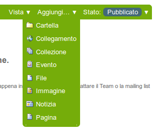

Aggiungere una Notizia
=======================

**Plone integra un sistema nativo per la pubblicazione di notizie.**

:Data: 18-04-2014
:Traduzione: Giovanni Giangiobbe
:Impaginazione: Giovanni Giangiobbe
:Revisione: Giovanni Giangiobbe

Per aggiungere una nuova notizia, utilizza la voce corrispondente del menù *Aggiungi* 
presente a livello di cartella Plone:

   add-new-menu.png

Avrai accesso al pannello *Aggiungi notizia*:

.. figure:: ../_static/addnewsitem.png
   :align: center
   :alt: 

Nel pannello, ci sono i campi standard Titolo, Descrizione e Commento alle modifiche,
insieme ad un editor visuale per inserire il corpo della notizia (Testo del documento)
ed ai campi per l'upload dell'immagine e per la sua didascalia.
Nel area Testo del documento puoi inserire qualsiasi tipo di testo, con la formattazione di cui hai bisogno,
e tramite la funzionalità Inserisci/modifica immagine dell'editor, puoi aggiungere al testo della notizia 
tutte le immagini che desideri. Le immagini caricate verranno aggiunte alla cartella nella 
quale stai creando la notizia.

I campi *Immagine* e *Didascalia immagine* servono ad aggiungere un'immagine che verrà
utilizzata come elemento grafico rappresentativo della notizia stessa all'interno degli
elenchi di notizie pubblicate sul sito Plone. L'immagine verrà automaticamente ridimensionata e 
posizionata in ciascun elenco. Se devi inserire un'immagine nel corpo del testo della notizia, pertanto, 
non devi utilizzare il campo Immagine, ma la funzionalità dell'editor visuale presente 
per il campo Testo del documento. 

**IMPORTANTE**: le notizie inserite non appariranno nell'elenco principale o nella portlet 
utilizzata per pubblicare le notizie sul tuo sito Plone finchè non saranno nello stato **"Pubblicato"**.
