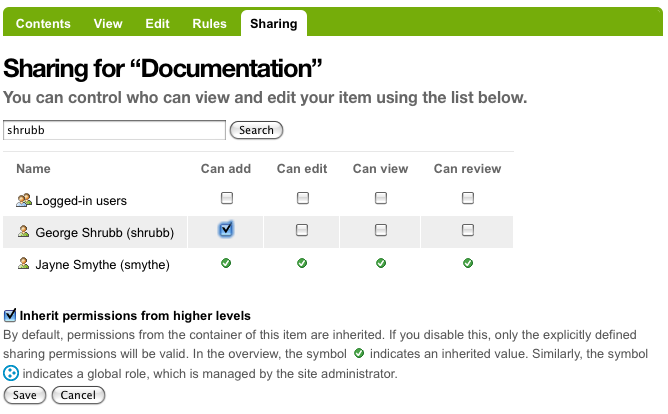

Collaborazione attraverso la condivisione
=========================================

**La scheda Condivisione consente di collaborare con altri utenti attraverso
l'uso di diversi ruoli integrati.**

:Data: 18-04-2014
:Traduzione: Alex Sani
:Impaginazione: Alex Sani
:Revisione: Giovanni Giangiobbe

Esempio 1: Consentire ad altri di aggiungere contenuti in una cartella che hai creato
------------------------------------------------------------------------------------

In questo esempio, Jane Smythe ha pieno accesso al suo sito Plone. Lei è in grado di
aggiungere, modificare, cancellare e pubblicare contenuti in qualsiasi parte del sito. Per ora,
ha creato una cartella denominata "Documentazione" e vi ha aggiunto una pagina,
"Presentazione Progetto". Non ha pubblicato né la cartella né il
documento. Il workflow di default per questo sito Plone non è stato
modificato. Ora vuole dare il permesso al suo collega, George Shrubb, di aggiungere contenuti alla cartella
Documentazione. Lui ha il permesso di modificare qualsiasi contenuto esistente,
ma lei ha bisogno che lui inizi ad aggiungere contenuti. Prima di proseguire
insieme a Jane, diamo uno sguardo a quello che George vede quando
si autentica in questo sito Plone:

.. figure:: ../_static/02b.png
   :align: center
   :alt:

Nota che in questo momento George non può nemmeno vedere la
cartella Documentazione perché quando Jane l'ha creata, l'ha lasciata nello stato *Privato*.
Tutte le autorizzazioni predefinite sono attualmente in atto e funzionano come previsto.

Jane conferisce a George le autorizzazioni necessarie per aggiungere contenuti alla
cartella Documentazione.

Jane passa alla cartella Documentazione e fa clic sul tab Condivisione:

.. figure:: ../_static/03.png
   :align: center
   :alt:

Una delle prime cose da notare è che Jane ha già tutte le
autorizzazioni disponibili per questa cartella. Queste autorizzazioni erano in realtà
state concesse in una sezione superiore del sito, come indicato dal simbolo di spunta verde.

Dando un'occhiata più da vicino, le autorizzazioni disponibili sono:

-  **Può aggiungere** - Questo significa che quando questa autorizzazione viene concessa ad un
   particolare utente (o gruppo di utenti), egli può aggiungere nuovi
   contenuti. Dal momento che l'utente è stato anche il creatore di quel
   contenuto, sarà in grado di modificarlo a suo piacimento.
-  **Può modificare** - Quando questa autorizzazione viene concessa per una cartella, l'utente
   può non solo modificare la Cartella (il titolo e la descrizione), ma può anche
   modificare uno qualsiasi degli elementi contenuti. Nota, tuttavia, che l'utente non è
   autorizzato ad eliminare il contenuto. Se questa autorizzazione viene concessa
   su una pagina, per esempio, l'utente può modificare solo quella pagina e nessuno degli
   altri elementi presenti nella cartella.
-  **Può vedere** - Quando questa autorizzazione viene utilizzata su una cartella o un altro
   elemento, l'utente può visualizzare il contenuto ma non apportare modifiche.
-  **Possono revisionare** - Quando questa autorizzazione viene concessa, l'utente può
   pubblicare i contenuti.

Nota: queste autorizzazioni sovrascrivono i permessi definiti nel workflow!
Ad esempio, se si concede ad un utente l'autorizzazione "Può vedere" in una pagina che è
nello stato privato, l'utente potrà vederla.

In questo esempio, Jane concede a George l'autorizzazione "Può aggiungere" nella
Cartella "Documentazione" in modo che possa aggiungere contenuti in essa. Per fare questo, come primo passo,
lo cerca utilizzando il suo nome:

.. figure:: ../_static/04.png
   :align: center
   :alt:

Jane ora può aggiungere le autorizzazioni necessarie a George per la cartella "Documentazione".
Deve selezionare il permesso "Può aggiungere" e premere "Salva":

Questo è tutto ciò che deve fare! Vediamo come George vede il sito ora.

Nota: George NON ha bisogno di disconnettersi e riconnettersi. Le autorizzazioni sono
sempre aggiornate perché sono controllate ogni volta che un utente accede a
qualsiasi cosa (ad esempio cliccando su un link) su un sito Plone.

George clicca sulla scheda *Home* (per esempio) per aggiornare la sua visione del
sito e visualizzerà la cartella "Documentazione":

.. figure:: ../_static/06.png
   :align: center
   :alt:

Quando George fa click sulla scheda "Documentazione", si accorge che può
visualizzare tutto il contenuto e che è ora in grado di
aggiungere i tipi di contenuto disponibili nela cartella, come mostrato nel menu *Aggiungi...*:

.. figure:: ../_static/07.png
   :align: center
   :alt:

George vuole visionare ciò che Jane ha già creato, quindi seleziona il link
Project Overview e vede:

|image25|

Anche se George può visualizzare il documento, le sue autorizzazioni limitate non gli consentono
di modificarlo o di cambiare il suo stato. L'unica cosa che può fare, al di là di
visualizzare il documento, è di farne una sua copia.

George aggiunge una pagina intitolata "Widget Installation" e ne crea il contenuto.
Quando ha terminato, la salva:

.. figure:: ../_static/08.png
   :align: center
   :alt:

Jane vede il lavoro fatto da George. Seleziona la scheda "Documentazione"
e vede che George si è dato da fare.
Clicca sulla pagina "Widget Installation"
per dare un'occhiata più da vicino:

.. figure:: ../_static/09.png
   :align: center
   :alt:

Si noti che Jane ha pieno accesso alla pagina che ha creato George. Lei
può modificarla così come tagliarla/copiarla/incollarla. In realtà lei attenderà che
George invii la pagina per la revisione prima di modificarla eventualmente.

Esempio 2: Permettere ad altri di modificare contenuti creati da te
-------------------------------------------------------------------

Sia Jane sia George hanno lavorato duramente per creare le pagine della cartella
Documentazione. **Jane ha pubblicato la cartella e
diverse pagine:**

.. figure:: ../_static/09b.png
   :align: center
   :alt:

Jane ha deciso che vuole consegnare a George i permessi di modifica (ma non di
pubblicazione) per tutti gli elementi cartella "Documentazione". Per fare questo Jane deve
tornare nella cartella "Documentazione" e cliccare sulla scheda *Condivisione*:

.. figure:: ../_static/10.png
   :align: center
   :alt: sharing10.png

   sharing10.png

Da qui deve solo selezionare la casella di controllo "Può modificare" e George
sarà in grado di modificare tutto il contenuto nella cartella "Documentazione" --
compresa la cartella "Documentazione" stessa. Quando successivamente George visiterà la
cartella e cliccherà su "Presentazione del progetto" (che è una pagina che Jane ha
creato), questo è quello che vedrà:

.. figure:: ../_static/11.png
   :align: center
   :alt: sharing11.png

Ora George può modificare qualsiasi elemento nella cartella "Documentazione", indipendentemente
da chi lo ha creato o da quando è stato creato.

Nel frattempo, Molly si è unita a George come nuovo membro del team. Molly aiuterà
George nell'aggiornamento del documento "Widget Installation". George va nella
scheda condivisione dell'elemento "Widget Installation", cerca il nome completo di Molly
(non il nome utente) e seleziona "Può modificare" per darle l'autorizzazione su questo
documento.

.. figure:: ../_static/12.png
   :align: center
   :alt: sharing12.png

   sharing12.png

Quando Molly entrerà nella cartella "Documentazione", potrà vedere i due
articoli pubblicati e l'elemento privato che ora è autorizzata a modificare:

.. figure:: ../_static/13.png
   :align: center
   :alt: sharing13.png

   sharing13.png

E, infatti, quando farà un click sul documento "Widget Installation", sarà
in grado di modificarlo:

.. figure:: ../_static/13b.png
   :align: center
   :alt: sharing13b.png

   sharing13b.png

Si noti, tuttavia, che quando Molly selezionerà uno dei due elementi dove non ha il
permesso di modifica, non avrà alcun ulteriore accesso. Può visualizzare
questi due elementi perché sono pubblicati come definito nel workflow di default di Plone
(il chè significa che chiunque può vederli).

.. figure:: ../_static/13c.png
   :align: center
   :alt: sharing13c.png

   sharing13c.png

Una nota finale su questo esempio: se la cartella "Documentazione" non fosse stata nello
stato di pubblicazione O Molly non avesse avuto delle autorizzazioni particolari
(per esempio, "Può visualizzare" nella cartella Documentazione), Molly avrebbe avuto
bisogno dell'URL completo per raggiungere il documento a cui le era stato dato
l'accesso per la modifica. Le autorizzazioni sono molto specifiche in Plone!

.. |image25| image:: ../_static/07b.png
