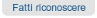
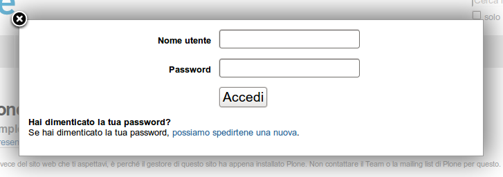

Autenticazione
===================

**Cosa aspettarsi quando ci si autentica in un sito Plone**

:Data: 27-11-2012
:Traduzione: Massimo Azzolini
:Impaginazione: Massimo Azzolini
:Revisione: Maurizio Delmonte [1-5-2013]

Quando visiti un sito Plone come anonimo, oppure ti viene dato un 
indirizzo web per manutenzione del sito, potrai vedere un bottone 
"Fatti riconoscere" in alto a destra come questo:

Una volta cliccato il link *Fatti riconoscere*, vedrai un pannello di
autenticazione dove inserire il tuo nome utente e la tua password:

Dopo l'autenticazione ad un sito web Plone, potrai vedere il tuo nome, 
solitamente in alto nell'angolo a destra del tuo schermo.
Puoi cliccare sul tuo nome per effettuare alcune azioni relative al tuo
utente, come spiegato nelle sezioni successive.

Da Plone 4 in poi, tu (o l'amministratore del sito) puoi permettere agli
utenti di utilizzare il loro indirizzo di posta elettronica come nome utente
per effettuare l'autenticazione.
Questa funzionalità può essere attivata nelle impostazioni di sicurezza nel
pannello di controllo. L'effetto è tale per cui:

* nel modulo di registrazione non viene richiesto uno specifico nome utente
* nel modulo di autenticazione viene chiesto all'utente di inserire l'email. 

Vedi `E-mail address based login in the Upgrade
Guide <http://plone.org/documentation/manual/upgrade-guide/version/upgrading-plone-3-x-to-4.0/e-mail-address-based-login>`_ per maggiori informazioni su questa funzionalità.
