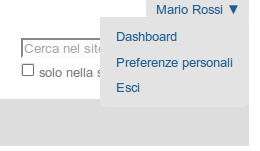
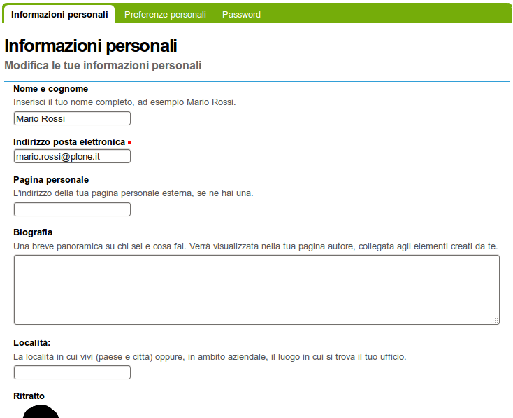

Impostare il tuo profilo
================================

**Una volta autenticato in un sito web Plone, puoi cambiare il tuo profilo
personale indicando informazioni circa la tua identità e scegliere le
impostazioni del sito web.**

Il tuo nome completo viene mostrato nell'angolo in alto a destra dello 
schermo. Clicca sul tuo nome per aprire il menù a discesa, quindi clicca
il link *Dashboard* per entrare nella tua area personale:

Vedrai la **dashboard** (o scrivania personale):

.. figure:: ../_static/dashboard.png
   :align: center
   :alt: 

La prima volta che ti autentichi, la dashboard sarà vuota come indica il 
messaggio di Info. Le **portlet** sono specifiche "viste" di vari tipi di 
contenuto. Puoi scegliere quali vedere nella tua dashboard cliccando
sul tab *modifica*, ma ci arriveremo in un secondo.

Prima di tutto, diamo un'occhiata al link *Preferenze personali*, nel menù di
cui parlavamo prima, che ti porterà alla modifica del tuo profilo:

I campi disponibili sono:

-  *Nome e cognome* - Indica il tuo nome completo.
-  *Indirizzo e-mail* - OBBLIGATORIO - Puoi ricevere email dall'amministratore
   del sito web, o da un forum, se installato, ecc. Quando un campo è obbligatorio,
   un piccolo quadrato rosso è presente a fianco del nome del campo.
-  *Località* - Questo è il nome della tua città, stato, provincia o qualsiasi
   altra informazione vorrai fornire.
-  Selezione della *lingua* - Plone eccelle nell'offire un supporto
   multilingua.
-  *Biografia* - Inserisci una breve descrizione di te stesso in questo 
   campo, un paragrafo o poco più.
-  *Pagina personale* - Se hai un tuo web site personale o, per esempio,
   un'area dove condividi foto, se vuoi puoi inserire qui l'indirizzo web.
   In questo modo altre persone potranno trovare più informazioni su di te.
-  *Editor* - Puoi scegliere di utilizzare TinyMCE o Kupu, che ti permettono
   di modificare le pagine web con una interfaccia grafica oppure una normale
   area di testo, che è adatta se sei abituato a scrivere pagine web in HTML
   (il "codice" base delle pagine web). L'impostazione di default per i 
   siti appena creati è di utilizzare TinyMCE, e, in questo manuale, 
   si assume che sia questa l'impostazione.
-  *Abilita la modifica con l'editor esterno* - Questa impostazione abilita
   e disabilita l'uso di un editor "esterno", se questo è stato impostato 
   dall'amministratore del sito web. L'uso di un editor esterno è principalmente
   inteso per web designer e programmatori che modificano il codice sorgente, ma 
   può essere utile per la creazione di pagine quando si usa un linguaggio di 
   markup specializzato. (Non ti preoccupare di questa impostazione se il tuo
   amministratore non te ne ha parlato esplicitamente).
-  *Ritratto* - Il tuo ritratto apparirà come una piccola immagine, quindi è 
   consigliata una foto del viso o del busto.

Puoi cambiare le tue preferenze ogni volta che vuoi.
