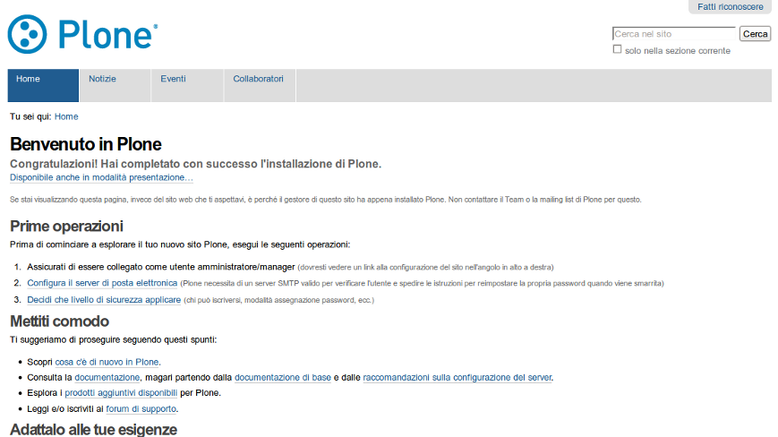
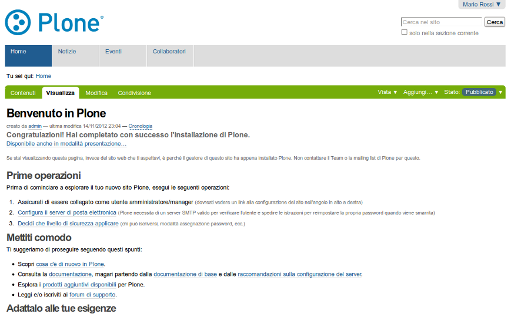
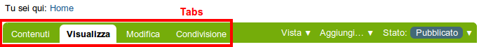
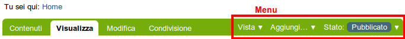

Account e Ruoli di un utente Plone
==================================

**In questo capitolo vedremo le basi di utilizzo di un account
utente su un sito Plone, la distinzione fra navigazione anonima
e quella autenticata e una descrizione dei ruoli degli utenti.**

:Data: 27-11-2012
:Traduzione: Giacomo Spettoli
:Impaginazione: Giacomo Spettoli
:Revisione: Maurizio Delmonte [29-4-2013]

I siti Plone possono essere di molti tipi, dal sito personale con un
solo utente ai portali di comunità ed organizzazioni con centinaia di utenti. 
Ogni persona che vuole aggiungere dei contenuti al sito deve avere un proprio 
account, definito da un nome utente e una password. 
Alcuni siti Plone consentono di auto-iscriversi visitando il collegamento "Accedi" e compilando un form con le proprie informazioni di base.
In altri siti invece gli account utente vengono creati solo dagli amministratori
del sito, nel qual caso le persone normalmente ricevono un messaggio di posta
elettronica con i dettagli del loro nuovo account.

In qualsiasi modo sia stato creato, un account utente Plone permette sempre
ad una persona di autenticarsi inserendo il proprio username e password.
Le password sono case-sensitive, cioè la stessa lettera viene considerata
diversa se scritta in maiuscolo o in minuscolo. Ad esempio, se la password è
xcFGt6v, l'utente deve scrivere esattamente questa password per potersi
autenticare. Le password con una buona variabilità di caratteri sono
preferibili a parole troppo semplici come "cane" o "giallo", poichè sono
più difficili da indovinare e quindi sono più sicure.

Differenze tra navigazione anonima e autenticata
------------------------------------------------

La distinzione tra *navigazione anonima* e *navigazione autenticata*
è molto importante:

Navigazione anonima
~~~~~~~~~~~~~~~~~~~~~

La navigazione anonima identifica la normale esperienza di un utente che
naviga un sito web. Si digita l'indirizzo web di un sito nel proprio browser
e si visualizza la pagina, si guardano video e immagini, ma non è necessario
autenticarsi. Ecco perchè questa viene chiamata navigazione anonima: chiunque
è anonimo prima dell'autenticazione. Da notare che la presenza del link
*Fatti riconoscere* (n.d.t. "Log in" in Inglese) nell'angolo in alto a destra
dell'immagine qui sotto. Se c'è un link "Fatti riconoscere" sulla pagina,
significa che non hai effettuato l'accesso e stai visitando il sito come
utente anonimo:

Navigazione autenticata
~~~~~~~~~~~~~~~~~~~~~~~~~~~~

Se hai utilizzato il sito di una banca, o qualsiasi altro sito che preveda 
l'uso di un account, allora hai già avuto esperienza di *navigazione utenticata*.
Il sito di una banca ad esempio ti
permette di vedere le informazioni del tuo account, di riempire dei form,
di trasferire dei fondi e altri tipi di operazioni, ma tutto questo solo dopo
aver effettuato l'accesso. Un sito Plone non è molto differente, ad eccezione
del fatto che si possono fare cose più complesse. Dai un'occhiata all'immagine
qui sotto, catturata dopo che un utente "Mario Rossi" ha effettuato l'accesso.
Vicino all'angolo in alto a destra, puoi vedere il link con il nome di 
Mario Rossi e un link di uscita. Un'altra differenza importante che si nota
quando si è autenticati è che nell'area principale al centro c'è una barra
verde con dei tab (o schede). Questa specie di striscia di testa è presente
quando un utente ha i permessi per modificare l'area del sito che sta visitando. 
I tab nella striscia verde potrebbero variare, ma avranno sempre questo aspetto 
e questo caratteristico colore. Nella seguente immagine, l'utente Mario Rossi si è
autenticato in un nuovo sito Plone:

Ruoli utente
-------------

In un sito Plone è molto importante la distinzione dei diversi ruoli
degli utenti. Per illustrare il caso più semplice, consideriamo due ruoli
utente: *collaboratore* e *manager*. Vediamo i diversi
permessi o "poteri" di questi due ruoli:

Collaboratore
~~~~~~~~~~~~~~

- ha un account utente, quindi può autenticarsi;
- può aggiungere contenuti, ma solo in aree specifiche, e non può modificare
  niente al di fuori di queste aree; spesso agli utenti viene assegnata
  un'area "home" da utilizzare come uno spazio personale dove possono
  aggiungere contenuti;
- non può pubblicare un contenuto per renderlo visibile nella navigazione anonima, 
  nemmeno nel caso dei contenuti che ha creato direttamente; un utente con il ruolo di manager dovrà approvare il contenuto per la pubblicazione.

Manager
~~~~~~~

- ha un account utente, quindi può autenticarsi;
- può aggiungere contenuti ovunque e ha il potere di modificare qualunque cosa;
- può pubblicare qualsiasi contenuto.

Quando ottieni il tuo nuovo account su un sito Plone, ti dovrebbero fornire
tutte le informazioni che indicano dove hai il diritto di aggiungere
contenuti. Dopo aver effettuato l'accesso, se vai in una cartella in cui hai
i permessi adeguati, vedrai la striscia di intestazione con il tipico
colore verde e le schede *Contenuti*, *Visualizza*, *Modifica*, *Regole*,
e *Condivisione*:

Potrai navigare per scoprire di persona le differenze tra questi tab,
ma ecco qualche indicazione per aiutarti a cominciare:

- *Contenuti* - mostra la lista dei contenuti in una cartella;
- *Visualizza* - mostra come un utente anonimo vede il contenuto corrente;
- *Modifica* - mostra un pannello per modificare il contenuto;
- *Regole* - mostra un pannello per gestire come un contenuto è creato
  e gestito;
- *Condivisione* - mostra un pannello per assegnare ad altri
  utenti i permessi per vedere e modificare il contenuto.

Puoi inoltre vedere i menu nella parte finale della barra verde, *Vista*,
*Aggiungi...* e *Stato*:

Esplora anche questi menu. Ecco qualche indicazione per partire:

- *Vista* - mostra il menu per sciegliere il tipo di visualizzazione (vista
  tabellare, vista riassuntiva, etc..);
- *Aggiungi...* - mostra il menu per aggiungere nuovi contenuti (immagini,
  pagine, cartelle, etc...);
- *Stato* - mostra il menu per modificare lo stato di pubblicazione (privato,
  bozza, pubblicato, etc..).

Questi menu e tab sono il modo principale per interagire con Plone.
Ti saranno molto familiari quando imparerai di più su come gestire un sito Plone.
