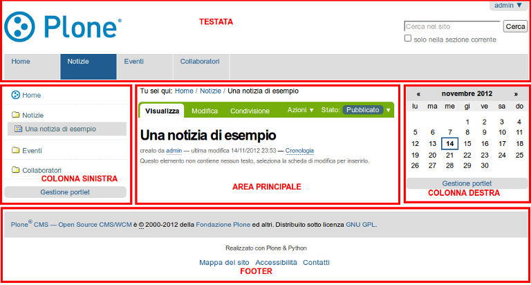

Design Grafico dei Siti Web Plone
=====================================

**Plone permette agli amministratori e ai designer dei siti web di creare
design unici. Ecco una panoramica del layout Plone, e alcuni esempi di
design.**

Come dovrebbe apparire un sito web Plone? Per anni c'è stato un
design coerente per l'aspetto predefinito di Plone. Il design
predefinito appare generalmente così:

|plone-default-design-areas.png|

Il tuo sito web Plone potrebbe avere un design radicalmente
diverso da questo, ma dovresti essere in grado di trovare elementi
comuni, come il link al log-in e un pannello o menu di navigazione.
Nel design di default, il menu di navigazione si trova nella zona a
sinistra, e di solito appare come un elenco indentato delle cartelle
del sito. Ci può anche essere un insieme di schede nella striscia *Log
In, Location Information* in testata.

Possiamo fare una distinzione tra il *design* e la
*funzionalità* di un sito web. Per quanto riguarda i contenuti,
concentrati sulla funzionalità e non preoccuparti tanto dell'aspetto
e del layout del sito web. Un punto di forza del sistema di gestione dei
contenuti Plone è che un sito web può essere radicalmente riprogettato
con un nuovo look, senza incidere sul contenuto sottostante e sulle
funzionalità. Il menu di navigazione potrebbe essere spostato da sinistra a
destra, ma funzionerebbe lo stesso. L'area di destra potrebbe essere cancellata
se le funzionalità che normalmente contiene non sono necessarie. Le aree
sinistra, centrale e destra, come illustrato sopra e sotto,
potrebbero essere spostate in alto, al centro e in basso, ma continuerebbe
comunque a essere un sito web Plone.

Useremo il design del layout di default di Plone come esempio di tipica
divisione dello schermo:

Potrebbe essere necessario adattare queste parti, se servono per il
design del tuo sito web Plone. Ti potresti imbattere in diversi termini
usati per descrivere le varie parti dello schermo, come ad esempio "slot"
sinistro e destro, per le colonne di sinistra e destra, "portlet", o
"viewlet", per zone o box specifici, e molti altri termini.

Per esempio, selezioniamo tre siti web dalla `lista di siti web Plone
<http://plone.net/sites>`_ per fare un confronto:

.. figure:: ../_static/akamaidesign.png
   :align: center
   :alt: 

Questo è il sito web per Akamai, un fornitore leader di strumenti web
online e acceleration technology. L'area di intestazione ha un semplice
menu testuale per cinque aree di contenuto principali disposte
orizzontalmente nella parte inferiore dell'area di intestazione. A destra,
l'intestazione contiene un altro menù orizzontale e una casella di ricerca.
La parte inferiore dell'area di intestazione conterrebbe dati di accesso,
per l'uso da parte dei manutentori del sito. La grafica principale in alto
a sinistra è una zona di messa a fuoco per la grafica accattivante e gli argomenti
attuali. C'è un'area principale al centro sinistra dove si trova il
testo più importante. La colonna di destra contiene una serie di "portlet".
Il piè di pagina contiene un menu orizzontale, ripetendo le scelte di menu
nell'intestazione, per comodità. C'è una colonna più a destra che contiene le
impostazioni di zoom.

.. figure:: ../_static/discoverdesign.png
   :align: center
   :alt: 

Questo è il sito web per Discover Magazine. L'area di intestazione contiene un
menu orizzontale di grandi dimensioni, il "menu principale", se si vuole chiamarlo così,
un menu orizzontale più piccolo in alto a destra, e una casella di ricerca. 
Questo sito è ricco di "portlet" testuali che coprono molte aree tematiche, divise
in tre colonne, sinistra, centro, e destra. La parte superiore della
colonna centrale contiene una zona focus con un video. 
Ci sono grandi box interattivi in diversi punti della pagina. 
Il piè di pagina contiene le informazioni di identificazione di base del sito e un 
link al "chi siamo". Per un grande sito web come Discover, i manutentori del sito 
effettuano il log-in per accedere a funzioni di editing personalizzate,
e c'è molta automazione nei flussi informativi - Plone utilizza Zope,
un sofisticato sistema di archiviazione, e Python, un celebre linguaggio di programmazione,
che facilita un intelligente "collegamento" del flusso di testo e grafica nel sito web.

.. figure:: ../_static/smealdesign.png
   :align: center
   :alt: 

L'ultimo dei tre siti da esaminare è il sito web per lo Smeal College of Business 
della Penn State University. L'intestazione contiene un logo, un
menu orizzontale per le aree tematiche principali, e una casella di ricerca a destra.
C'è un menu principale per questo sito a sinistra, il che è più tradizionale per un
sito web Plone. Una vasta area grafica contiene un'animazione "rolling focus".
C'è un altro piccolo focus grafico nella colonna di sinistra.
Tre colonne testuali completano il design, al di sopra dell'identificazione di base a
piè di pagina. I manutentori di questo sito accedono per mezzo di una pagina di
log-in personalizzata, con il log-in e le informazioni utente che appaiono lungo la
parte inferiore dell'area più in alto in testata.

Allora, come dovrebbe apparire un sito web Plone? Tradizionalmente, l'aspetto
out-of-the-box è simile a quello mostrato nella parte superiore di questa pagina, con
intestazione, menu, colonne, e un piè di pagina. Questi tre siti illustrano come i
designer tipicamente combinano le aree di interesse, i menu verticali e orizzontali,
"portlet" e contenuti testuali, di solito disposti in diverse colonne. La
struttura di base della pagina è generata da Plone, Zope e Python, ma il "tema" o "skin" 
di design può essere fatto risultare in qualunque modo il designer preferisca.

.. |plone-default-design-areas.png| image:: ../_static/plone-default-design-areas.png
