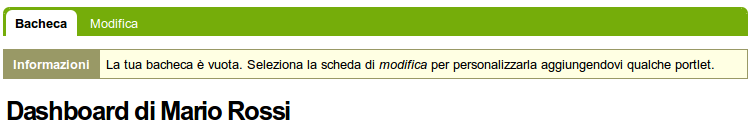
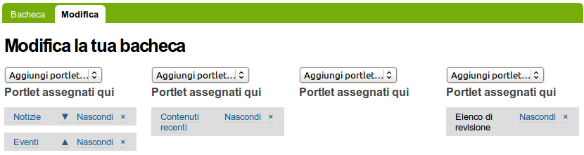

La tua Dashboard
===================

**Ogni utente Plone ha una "dashboard" personale per personalizzare 
l'interfaccia dell'utente.**

:Data: 27-11-2012
:Traduzione: Massimo Azzolini
:Impaginazione: Massimo Azzolini
:Revisione:

Plone ha diversi "viste" predefinite per le notizie, gli eventi,
i documenti modificate recentemente, ecc. Queste liste sono raggruppate
in aree rettangolari chiamate portlet. Pensa ad una portlet come ad una 
finestra su un dato tipo di contenuti. Per esempio, la portlet "notizie"
offre una vista delle notizie pubblicate recentemente.

Tu controlli quali portlet vedi nella tua dashboard e dove sono disposte.
Il seguente screenshot mostra cosa l'utente George Shrubb vedrebbe una
volta che si fosse autenticata e che avesse cliccato sul suo nome, posto
in alto a destra, per andare alla sua area personale:

La dashboard appare vuota per un nuovo utente.

Un click sul tab di modifica per la dashboard mostrerà che ci sono 
portlet già assegnate alla dashboard -- la dashboard mostrata sopra 
è vuota perchè non ci sono contenuti disponibili da mostrare nelle 
portlet di questo nuovo sito web. Ecco le portlet di default:

Vedi le portlet *Notizie* ed *Eventi* nella colonna più a sinistra,
i *Contenuti recenti* nella seconda colonna e l'*Elenco di revisione*
nella colonna di destra. La terza colonna non ha portlet assegnate.

L'account di un nuovo utente, in un sito web Plone base, avrà una 
dashboard come quella mostrata, ma per un sito web che è stato personalizzato
con funzionalità aggiuntive potrebbero esserci più portlet tra cui 
scegliere e la dashboard potrebbe partire con diverse portlet già
posizionate nelle colonne. Per esempio, potrebbero esserci portlet
per "il meteo", "quotazioni di borsa", "frase del giorno", ecc. 
a seconda di cosa è stato installato sul sito web (queste opzioni
richiederebbero software personalizzato). L'utente può personalizzare
le portlet che vuole vedere e la loro posizione tra le quattro 
colonne.

Quindi, per l'account Plone tipico, la dashboard parte con le portlet
mostrate sopra che verrebbero popolate con le news, gli eventi e gli
altri contenuti creati nel sito web.
