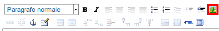
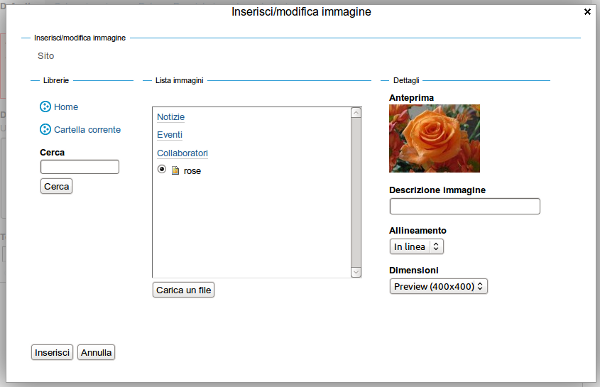
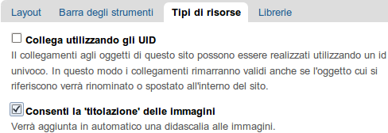
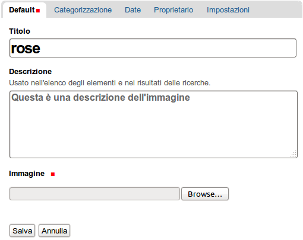
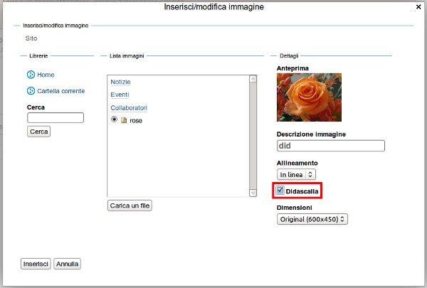
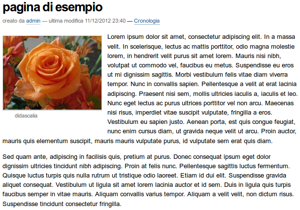

Inserire delle immagini
=========================

**Una panoramica delle opzioni disponibili per l'inserimento di immagini in
TinyMCE.**

L'editor TinyMCE ti permette di inserire delle immagini caricate in Plone nella
tua pagina, utilizzando il bottone |Image| sulla barra degli strumenti di TinyMCE:

Cliccando su questo bottone, si apre la finestra per inserire un immagine:

Le tre colonne della finestra sono:

- nella prima colonna c'è la lista di navigazione delle cartelle
- nella seconda colonna c'è la lista dei contenuti della cartella corrente
- nella terza colonna c'è l'anteprima dell'immagine, le opzioni di allineamento,
  le dimensioni disponibili per mostrare l'immagine e la didascalia.

Nell'esempio sopra, è stata selezionata l'immagine di una rosa - rose.png (
l'immagine originale è piuttosto grande, 600\*450 pixel).

L'immagine verrà posizionata nella pagina in accordo al "Allineamento"
scelto e verrà generato il seguente codice HTML:

-  A sinistra ()
-  A destra ()
-  In linea ()

Puoi anche scegliere la dimensione dell'immagine di cui hai bisogno.
Questo è particolarmente utile quando hai a che fare con immagini di grandi
dimensioni, poichè non c'è bisogno di utilizzare Photoshop o altre applicazioni
esterne per ritagliare o modificare  l'immagine. Il menu a tendina "Dimensioni"
ti consente di scegliere tra diverse dimensioni e formati:

.. figure:: ../_static/image_size.jpg
   :align: center
   :alt: 

-  Large ();
-  Preview ();
-  Mini () - questa è la
   dimensione minima per la visualizzazione dell'immagine;
-  Thumb () - a
   thumb(inch)- dall'immagine verrà estratta una miniatura; (un pò più
   piccola di 2,5cm);
-  Tile () - a tile is made
   out of your image;
-  Icon () - dall'immagine
   verrà ricavata un'icona;
-  Listing () - dall'immagine
   verrà ricavata una piccola immagine in stile 'elenco';

Image Captioning
----------------

In TinyMCE è possibile mettere una didascalia sotto l'immagine. La didascalia
è presa dalla descrizione dell'immagine. Il testo alternativo è tratto dal
titolo dell'immagine. Il testo alternativo e la didascalia si aggiornano
automaticamente se l'immagine viene aggiornata.

Per abilitare questa funzione accedere a **Configurazione del sito ->
Editor TinyMCE**. Assicurati di selezionare **Consenti la 'titolazione'
delle immagini** nella  tab **Tipi di risorse**.

Ora quando aggiungi un'immagine sul sito, puoi inserire una breve descrizione
e questa verrà utilizzata come didascalia.

Ora quando crei una pagina e inserisci un'immagine in essa, seleziona il box
Didascalia:

Ora, salvando le modifiche, il risultato dovrebbe essere simile a questo,
con la descrizione dell'immagine inserita come didascalia all'interno di una
cornice:

.. |Image| image:: ../_static/image.gif
